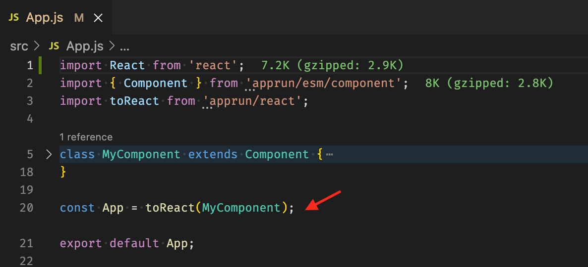

# Use AppRun with Create React App

Using AppRun and React in conjunction is one of the best ways to build a web app.

[React](https://reactjs.org/) is a popular JavaScript library for building user interfaces.

[AppRun](https://apprun.js.org/) is an elm-inspired event-driven library.

It takes only three lines to use the [state management](https://apprun.js.org/docs/state-management/) and [event pub-sub](https://apprun.js.org/docs/event-pubsub) from AppRun in the React apps and make the React apps having the [elm-inspired architecture](https://apprun.js.org/docs/architecture).




## Getting Started

- Run `npm start`
- Edit [App.jsx](#src/App.jsx) and watch it live update!


## How it's Made

This project was bootstrapped with [Create React App](https://github.com/facebook/create-react-app).

Then, we add AppRun.

```sh
npm install AppRun -D
```

Finally, we mount an invisible [AppRun Component](https://apprun.js.org/docs/component/) inside a React Component.

```js
import { useState } from 'react';
import { Component } from 'apprun/esm/component';

// initial state
const model = 0;

// rendering logic
function view (state) {
  return <div>{state}</div>;
}

// event handlers
const update = {  }
}

function App() {
  const [state, setState] = useState(model);
  const [component] = useState(new Component(model, setState, update).mount());
  return <>{view.bind(component)(state)}</>;
}

export default App;
```


Have fun!